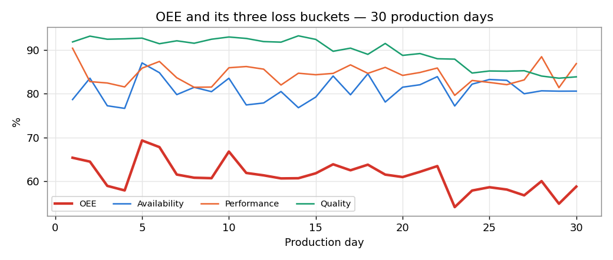
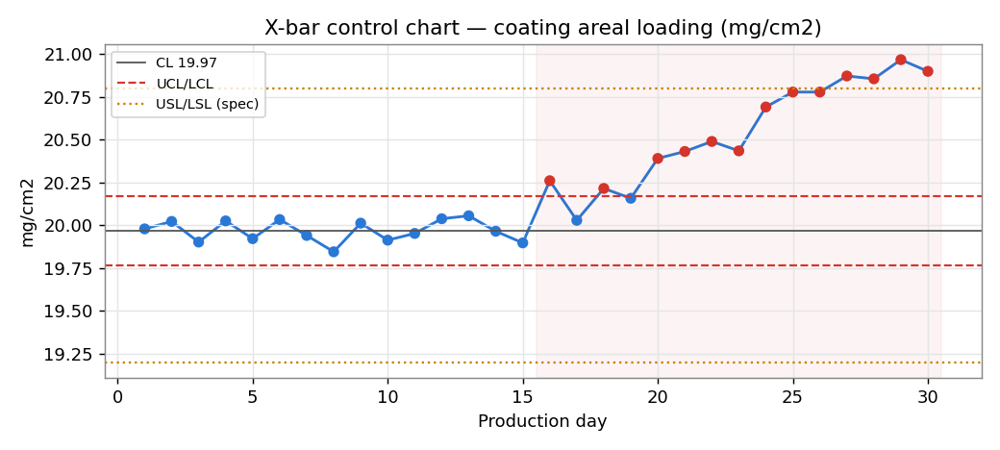
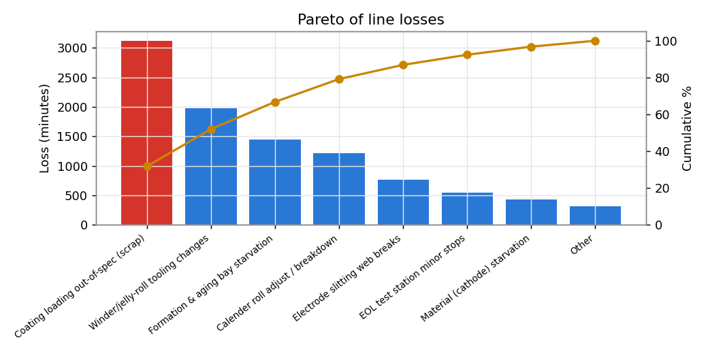

# 4680 Cell-Line OEE Recovery — an SPC / DMAIC Case Study

A self-directed process-engineering project: diagnose why a ramping **4680 battery-cell electrode line** is stuck at low OEE, catch the root cause with **statistical process control**, and quantify the recovery — end to end in Python, structured as a **Six Sigma DMAIC** project.

> **Data is simulated.** I generated a calibrated synthetic dataset so I could *plant a known process drift and prove the method catches it.* The framing (Tesla's 2026 six-line ramp, 4680 cell manufacturing) is drawn from Tesla's public Q4/FY-2025 shareholder update; the numbers are illustrative, not Tesla's. The method, math, and reasoning are real.

---

## The problem

A new 4680 electrode line, still in ramp, runs at **~61% OEE** (world-class is ~85%) with first-pass **quality yield near 90% against a 98% target**. Cell lines are notoriously harder to ramp than vehicle assembly — they're *continuous* processes where a coating step drifts slowly rather than failing outright. The question isn't "buy more capacity," it's **"where is the output actually leaking, and what's the one constraint to fix first?"**

## What I did (DMAIC)

| Phase | Work | Result |
|---|---|---|
| **Define** | Scoped one line, one Critical-to-Quality parameter: electrode **coating areal loading** (20.0 ± 0.8 mg/cm²). | Charter with a measurable, bounded goal. |
| **Measure** | Computed **OEE = Availability × Performance × Quality** over 30 production days. | OEE **61.2%** = 80.9% × 84.3% × 89.7%. |
| **Analyze** | Built an **X̄ control chart** (subgroups of 5) with limits from the in-control baseline; ran a **capability study** and a Pareto. | Special-cause drift caught at **day 16**; **Cpk collapsed 1.77 → 0.02**; two causes = 52% of loss; coating↔scrap **r = 0.97**. |
| **Improve** | Modeled a CAPA (SPC reaction plan + condition-based PM) closing the quality gap. | Projected **OEE 61% → 70%**, ~**+14% throughput**, zero new capital. |
| **Control** | Defined the reaction plan + poka-yoke that hold the gain. | Detection lag **~10 days → < 1 shift**. |

## Key visuals





## Results at a glance

See [`results.md`](results.md) (auto-generated by the analysis). Headline: a slow coating-loading drift, invisible for ~10 days under manual review, drove a six-figure scrap loss; SPC catches it on day one of the drift, and closing the quality gap alone recovers ~9 OEE points.

## How to run

```bash
python -m venv venv && source venv/bin/activate   # Windows: venv\Scripts\activate
pip install -r requirements.txt
python src/generate_data.py     # writes data/*.csv  (seeded — reproducible)
python src/analysis.py          # writes results.md + figures/*.png
```

## Repo structure

```
src/generate_data.py   synthetic 30-day line, with a planted coating drift + causal scrap link
src/analysis.py        OEE, SPC (X-bar/R), Cpk, Pareto, coating->scrap correlation, projected recovery
data/                  generated CSVs (daily metrics, coating subgroup readings)
figures/               OEE trend, SPC chart, Pareto (generated)
results.md             auto-generated metrics table
```

## Skills demonstrated

Lean Six Sigma (DMAIC) · Statistical Process Control (X̄-R, Western Electric rules) · Process capability (Cp/Cpk) · OEE decomposition · Root-cause analysis (5-Whys) · CAPA & control plans · Pareto analysis · Python (NumPy, pandas, matplotlib) · reproducible, seeded data pipelines.

## Roadmap

- Interactive **Power BI** dashboard (KPI cards + live SPC + Pareto + day slicer) as the leadership-facing layer.
- **PFMEA** worksheet (S×O×D → RPN, before/after) and a formal Control Plan document.

---
*Independent project by Rishikesh Selvaraj Pillai (MS Engineering Management, Northeastern). Not affiliated with or endorsed by Tesla. Data simulated to demonstrate method.*
